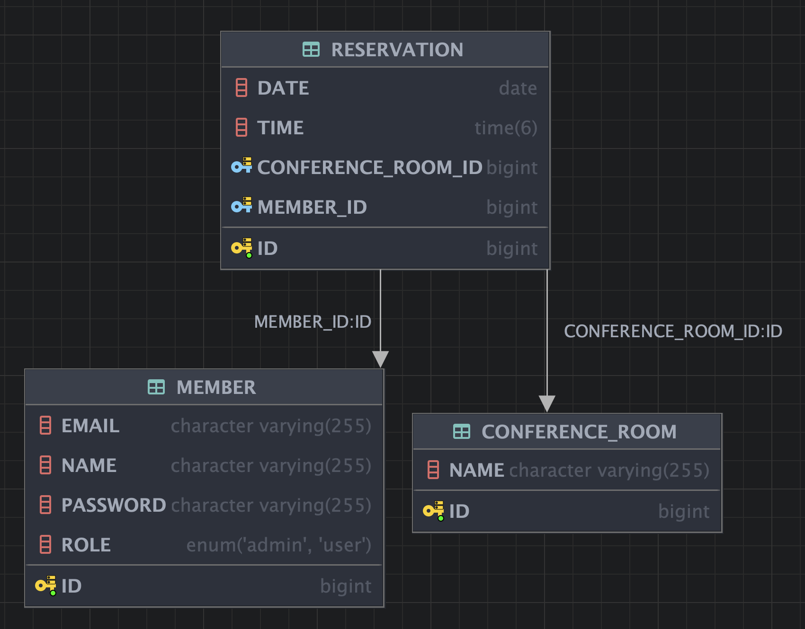

# 회의실 예약 시스템

## ✅ 기능 요구 사항

### 예약하기

- [x] 사용자는 회의실을 예약할 수 있다.

**예외 사항**

- [x] 공휴일에 예약을 한다면, 예외를 발생한다.
- [x] 예약이 이미 존재한다면, 예외를 발생한다.
- [x] 과거로 예약을 시도한다면, 예외를 발생한다.

### 예약 조회

- [x] 모든 사용자는 예약 현황을 조회할 수 있다.
- [x] 본인의 예약 상세 정보를 확인할 수 있다.

### 예약 수정

- [x] 본인의 예약을 수정할 수 있다.
- [x] 본인의 예약을 삭제할 수 있다.

**예외 사항**

- [x] 타인의 예약을 수정하려고 한다면, 예외를 발생한다.
- [x] 타인의 예약을 삭제하려고 한다면, 예외를 발생한다.

### 회의실 생성/삭제

- [x] 어드민은 회의실 생성이 가능하다.
- [x] 어드민은 회의실 삭제가 가능하다.

**예외 사항**

- [x] 일반 유저가 회의실을 생성하려고 한다면, 예외를 발생한다.
- [x] 일반 유저가 회의실을 삭제하려고 한다면, 예외를 발생한다.

### 사용 외부 API

- 특일 정보 제공 서비스

## 도메인 설계

## 구현 목적

- 로그인 관련 Global 설정은 이전 코드를 참고해, 활용했습니다.
    - 외부 API를 다시 한 번 적용시켜보는 것에 목적을 두고 미션을 진행하게 되었습니다.

- 에약 생성 시, 외부 API 호출을 통해 공휴일을 확인했습니다.
    - 매번 외부 API 호출을 하는 것은 성능상 문제가 될 수 있는 것을 인지하고 있습니다.
    - 이는 한 달에 한 번 호출을 통해 DB에 저장하는 방식으로 해결 가능합니다.
    - 그러나, 이 부분을 구현하는 것은 이번 미션에서 진행하지 않았습니다. 
